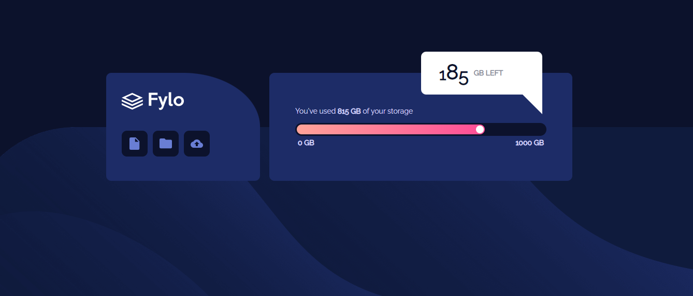

# Frontend Mentor - Fylo data storage component solution

## Table of contents

- [Overview](#overview)
  - [The challenge](#the-challenge)
  - [Screenshot](#screenshot)
  - [Links](#links)
- [My process](#my-process)
  - [Built with](#built-with)
  - [What I learned](#what-i-learned)
  - [Continued development](#continued-development)
  - [Useful resources](#useful-resources)
- [Author](#author)

## Overview

### The challenge

Users should be able to:

- View the optimal layout for the site depending on their device's screen size

### Screenshot



## My process

### Built with

- Semantic HTML5 markup
- CSS custom properties
- Flexbox
- CSS Grid
- Mobile-first workflow

### What I learned

I learned to create message pop-ups using css triangles. The trick is really the border-width and color;

```css
.pop-up:after {
  content: "";
  position: relative;
  inset-block-end: -73%;
  display: block;
  width: 0;
  height: 0;
  border-style: solid;
  border-width: 0 40px 40px 0;
  border-color: transparent #fff transparent transparent;
}
```

### Continued development

I think I really need to know the ins and outs when it comes to triangles and thing but it turns out i suck a little so going forward i need to pay attention there.

### Useful resources

 - A place to generate css triangles, really cool.😍

## Author

- George Asiedu - [@george5-star](https://www.frontendmentor.io/profile/george5-star)
